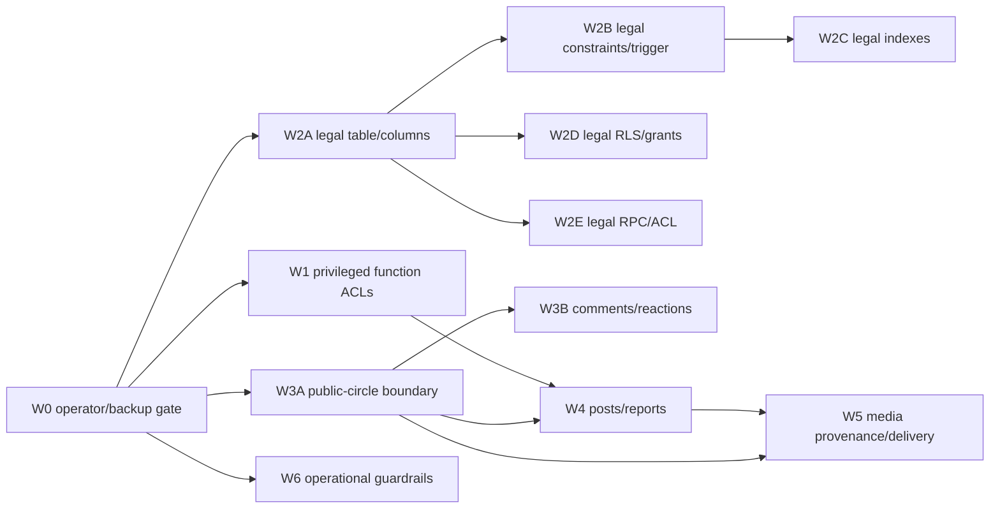

# Production Forward Reconciliation Plan

Status: `LEGAL_TRUST_CONSENT_FOUNDATION_V1_PRODUCTION_RECONCILIATION_NO_GO`.

This is a deterministic planning artifact, not an authorization to mutate production. Wave 1's consolidated proposal remains `PROPOSAL_AUTHORED_LOCAL_VALIDATED_UNEXECUTED` and is now `BLOCKED_PENDING_CIRCLE_ACCESS_PREREQUISITE_EXECUTION_AND_POSTFLIGHT`: the failed approved transaction proved production lacks `public.can_access_public_circle(uuid)`, and the subsequent one-shot preflight now supports a separately authored, function-only prerequisite proposal. Do not use `db push`, blind historical replay, or migration-history repair.

## Evidence baseline

- Compared source commit: `4af2a9b023c7c75b53d40fdbe49e28de5021fc52`.
- Production export SHA-256: `665B90027392A3D91FB45E4A88D6B0B7F4A10E98FB2B292FD5BE775A84DCBAEF`.
- Expected normalized entries: `1,133`; parsed production entries: `1,011` (`1,009` non-ledger plus two ledger entries).
- Comparison: `974 MATCH`, `134 MISSING`, `25 DIVERGENT`, `10 EXTRA`, `0 INSUFFICIENT_EVIDENCE`.
- Repair manifest: `168` actionable comparison entries, collapsed into `75` logical repair objects. The ten extras contain nine security-relevant entries; the harmless authenticated comment-reaction SELECT grant is retained as evidence, not a repair item.
- Security findings: `151`. One logical object can produce multiple findings because the fingerprint independently captures function definition, role ACL, catalog grant, policy, RLS state, index, constraint, and trigger facts.
- Severity totals: `31 P0_SECURITY_BROADENING`, `120 P1_REQUIRED_SECURITY_OBJECT_MISSING`, `3 P2_SECURITY_AVAILABILITY_DIVERGENCE`, and `14 P3_NON_SECURITY_SCHEMA_DRIFT`.

The machine-readable source of truth is [production-schema-forward-reconciliation.json](../../tests/fixtures/production-schema-forward-reconciliation.json). It retains the exact expected and observed structural definitions/hashes, source migrations, runtime callers, dependencies, operation strategy, verification requirements, wave, and forward-fix class for every scheduled comparison entry.

## Two independent tracks

**Track A: object reconciliation.** Reconcile production objects to the verified secure target through separately approved forward changes, each with read-only preflight and non-production replay.

**Track B: migration-history reconciliation.** Consider only after Track A is fully verified. Do not insert, update, delete, repair, or mark `schema_migrations` history in Track A. The two recorded historical versions are divergent by object evidence; the other 41 unrecorded versions are not presumed absent.

## Dependency graph

The order keeps a table before its constraints/indexes/RLS/RPC, a predicate function before policies that call it, and a replacement ACL after its exact function signature is verified. Every policy replacement must remain inside a transaction-safe group; never disable RLS or leave an authorization boundary absent between replacements.

## Waves

| Wave | Objects | Strategy and prerequisites | Stop conditions |
| --- | ---: | --- | --- |
| W0 operator gate | 0 | Exact target confirmation, tested backup/restore evidence, maintenance decision, offline manifest approval, and read-only preflight only. | Wrong target, missing backup rehearsal, unresolved operator/legal approval, or preflight anomaly. |
| W1 ACL/function hardening | 2 | One `PROPOSAL_AUTHORED_LOCAL_VALIDATED_UNEXECUTED` execution packet: `insert_forum_notification(...)` retains its exact body and converges metadata/ACL; `increment_post_view_count(uuid)` restores the reviewed security predicates plus metadata/ACL. Both await fresh preflight and human approval. | Any signature/body/owner/search_path mismatch, unknown caller, grant outside the approved role matrix, or a body change without a completed source-backed semantic review. |
| W2A legal table/columns | 15 | `legal_policy_acceptances` table plus 14 columns; `CREATE_MISSING` only after duplicate/version/source aggregate checks. | Existing table conflict, duplicate user/bundle rows, invalid policy versions, or incomplete backup. |
| W2B legal constraints/trigger | 13 | Twelve acceptance constraints and updated-at trigger; `ADD_CONSTRAINT_NOT_VALID_THEN_VALIDATE` where data exists. Depends on W2A. | Any violation count is nonzero or trigger target/function differs. |
| W2C legal indexes | 3 | Primary/unique/bundle-confirmed indexes; `CREATE_INDEX_CONCURRENTLY` where an index operation is separately approved. Depends on W2B. | Duplicate/lock budget failure or wrong index definition. |
| W2D legal RLS/grants | 2 | Own-row policy and table ACL set; `DROP_AND_RECREATE_POLICY_IN_TRANSACTION` and `REVOKE_AND_GRANT`. Depends on W2A. | RLS not enabled, unexpected broad grant, or actor-isolation test failure. |
| W2E legal RPC/ACL | 1 | `record_current_legal_policy_acceptance(...)`; exact signature, owner, search_path, service-role-only ACL, and renewal idempotency. Depends on W2A. | RPC duplicate/renewal aggregate check fails or any browser role gains execution. |
| W3A public-circle boundary | 4 | `can_access_public_circle`, circle status constraint, public SELECT policy, and extra owner/staff DELETE policy review. Create/replace predicate before policies. | Inactive/test/private circle becomes publicly visible or policy classification remains uncertain. |
| W3B comments/reactions | 11 | Comment-create/read/reaction predicates, comment/reaction policies, and unexpected direct grants. Depends on W3A. | Published comment/post/circle ancestry mismatch, zero-write denied-path test failure, or extra policy intent unresolved. |
| W4 posts/reports | 7 | Posts RLS set, `can_create_user_report_target`, reports INSERT policy, and view-count index. Depends on W3A and W1. | Public post/report target can bypass moderation/circle visibility, or view count caller cannot use the narrowed ACL. |
| W5 media provenance/delivery | 13 | Canonical media-key and delivery predicates, post-media/storage policies, and bucket configuration. Depends on W3A and W4. | Cross-user/post media key, private-circle object, or malformed storage path is accepted; bucket state differs from reviewed target. |
| W6 operational guardrails | 4 | Upload-attempt indexes and two extra policies; apply only after human intent review. | Existing data/index conflict, policy purpose unclear, or lock budget rejected. |

No wave exceeds 15 logical objects or six tables. Every item has a forward-only strategy, verification step, and rollback/forward-fix class in the manifest. A failed verification means stop the wave and prepare a reviewed forward fix; do not roll back access control by broadly restoring old policies.

## Required domains and preflight evidence

### SECURITY DEFINER and ACLs

W1 begins with the observed `PUBLIC:EXECUTE` exposure on `increment_post_view_count` and `insert_forum_notification`, plus the divergent authenticated/service-role ACLs. The notification body exactly matches; the post-view [forensic comparison](legal-consent-production-reconciliation-wave1b.md) proves its production body lacks the source-intended moderation and public-circle predicates. The single [Wave 1 proposal](reconciliation/legal-consent-production-wave1-proposal.sql) preserves the notification body while converging its metadata/ACL and restores only the verified post-view body plus its metadata/ACL. Its only direct missing dependency now has the separate [function-only proposal](reconciliation/can-access-public-circle-proposal.sql) and [read-only postflight](reconciliation/can-access-public-circle-postflight.sql). The production `hidden` status constraint, broad `circles_select_public`, and extra delete policy remain separately scheduled circles reconciliation objects; none alters the helper's fixed SECURITY DEFINER boolean result. Only after separately approved prerequisite Stage 1 and postflight may an operator rerun the combined Wave 1 preflight, obtain a new explicit Stage 2 approval, and execute the existing Wave 1 packet. `can_create_user_report_target` is included in W4 with its report-policy dependency. No generic function grant is permitted.

### Legal-consent persistence

W2 restores the table, integrity constraints, uniqueness, index, trigger, own-row policy, grants, and the service-role-only acceptance RPC as dependent objects. Read-only preflight must return aggregate counts for duplicate `(user_id, bundle_version)` rows, invalid/stale bundle versions, impossible confirmation counts/timestamps, and malformed source fields. The active legal bundle remains application-owned configuration and needs a separate legal/operator decision; it is not invented as a database migration row.

### RLS, report, and moderation authorization

W3/W4 verify exact role, USING, and WITH CHECK differences for each divergent policy in the manifest: circles; comments; comment reactions; posts; reports; plus the extra policies. Preflight aggregate checks cover posts/comments bound to missing or inaccessible circles, invalid report targets, orphan notifications, cross-user notification rows, and safety rows whose actor/target hierarchy is invalid. Report events, moderation actions, user-safety hierarchy, and notification recipient isolation remain verification anchors even where the fingerprint did not schedule a direct object mutation.

### Media authorization and provenance

W5 requires aggregate-only preflight for storage paths with wrong actor/post/circle binding, malformed key segments, null provenance, or references to inaccessible posts/circles. It must prove post-bound provenance before post-media INSERT/UPDATE, then public delivery functions before storage/public-read policies. A private circle or private profile/post object must never become readable during the change window.

## Transaction, locking, and data rules

- Policy/function/ACL changes are grouped transaction-safely after their dependencies exist; do not drop a protective policy before its replacement is ready.
- Index changes use the planned concurrent strategy and require an operator-approved lock/maintenance budget.
- New constraints require aggregate violation checks first and use the planned not-valid/validate path when existing data is possible.
- Existing production data is never included in exported artifacts. Preflights return counts and sanitized structural identifiers only.
- Every data-sensitive object is `ADDITIONAL_READ_ONLY_PREFLIGHT_REQUIRED`; uncertain extra objects are `HUMAN_DECISION_REQUIRED` and are not silently dropped.

## Review checklist

- [ ] Database/security reviewer approves the exact manifest item set, severity, dependency graph, and ACL matrices.
- [ ] Application reviewer confirms every listed runtime caller and rejects unknown direct RPC/table callers.
- [ ] Data-integrity reviewer approves all aggregate preflight queries and zero/nonzero stop thresholds.
- [ ] Operator confirms exact target, tested backup/restore, incident owner, maintenance/availability decision, and lock budget.
- [ ] Non-production replay uses the same ordered waves, validates catalog fingerprints, and proves denied paths have zero writes.
- [ ] Legal/operations owner resolves active policy bundle and public contact/legal-review blockers.
- [ ] Human approval is recorded for each wave before any non-production or production action.

Production remains `NO_GO`. The next safe action is a fresh, attached W1A and W1B preflight on a verified non-production target and human review of the two isolated proposals. No production SQL, deployment, migration execution, or migration-history operation is authorized.
